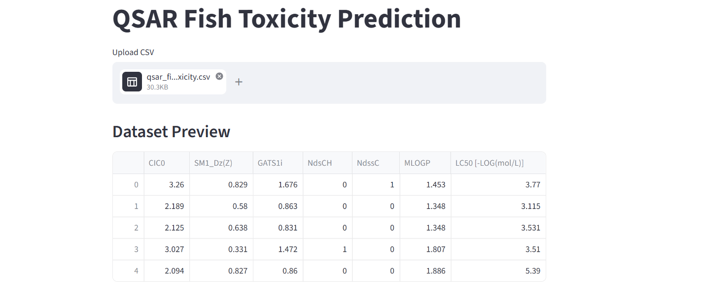
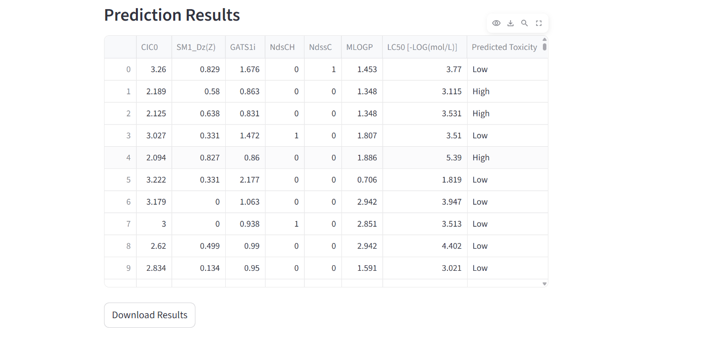

# QSAR Fish Toxicity Prediction

This project focuses on predicting fish toxicity using Quantitative Structure-Activity Relationship (QSAR) modeling and machine learning techniques.
- Topic: QSAR Fish Toxicity

##  Overview
The goal of this project is to analyze chemical data and predict toxicity levels in fish using various machine learning models.

##  Live Demo

 Try the app here:  
https://qsar-fish-toxicity-prediction-gncxgdb5yrchq6hqmwbybzx.streamlit.app

##  App Preview

###  images

##  Technologies Used
- Python
- Pandas
- NumPy
- Matplotlib
- Seaborn
- Scikit-learn

##  Features

- Upload CSV dataset
- View dataset preview
- Predict fish toxicity
- Visualize results
- Download prediction output

##  Workflow
1. Data Analysis
2. Data Visualization
3. Feature Selection
4. Model Training
5. Model Evaluation

##  Models Used
- Linear Regression
- Ridge Regression
- Lasso Regression
- Decision Tree Regressor
- Random Forest Regressor
- Support Vector Regression (SVR)

##  Evaluation Metrics
- Mean Absolute Error (MAE)
- Mean Squared Error (MSE)
- R² Score

##  Objective
To build an accurate predictive model for fish toxicity using QSAR dataset and compare performance of different ML algorithms.
